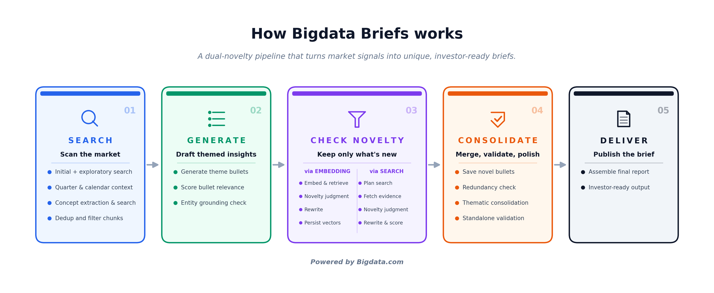

# Bigdata Briefs v2.0

A LangGraph pipeline that generates structured, novelty-filtered brief reports for a universe of companies. For each entity and date window, the service retrieves news evidence from the Bigdata API, extracts material bullet points, and filters them for relevance and novelty before writing them to the database. Results are exposed through a web app, a REST API, and an MCP server.

## Three ways to use it

The same pipeline is reachable through three front doors. Pick the one that fits how you work:

| | Who it's for | What you do |
|---|---|---|
| **Web app** ([Part 1](#part-1-the-app)) | Humans, no coding | Browse briefs and run updates in the browser at `http://localhost:8000/app/desk/`. |
| **MCP**<br>([Part 2](#part-2-mcp)) | AI assistants (Claude, etc.) | Let an assistant run briefs and read results conversationally through MCP tools. |
| **REST API** ([Part 3](#part-3-the-api)) | Scripts, integrations, your own code | Trigger runs and read results over HTTP (`curl`, `requests`, etc.) against `http://localhost:8000/api/v1/`. |

All three run the **same pipeline**. The web app and MCP (stateful server) are just clients of the REST API; the only standalone variant is the self-contained stateless MCP server, which runs the pipeline in-process with no separate service or database.

## Contents

- [Architecture overview](#architecture-overview)
- [Part 1: The App](#part-1-the-app)
  - [Prerequisites](#prerequisites)
  - [Quickstart](#quickstart)
  - [The Brief](#the-brief)
  - [Portfolio](#portfolio)
  - [Costs](#costs)
  - [Scheduled runs (cron job)](#scheduled-runs-cron-job)
- [Part 2: MCP](#part-2-mcp)
  - [Which server to use](#which-server-to-use)
  - [Stateful server (briefs-mcp)](#stateful-server-briefs-mcp)
  - [Stateless server (briefs-mcp-stateless)](#stateless-server-briefs-mcp-stateless)
  - [MCP tools reference](#mcp-tools-reference)
- [Part 3: The API](#part-3-the-api)
  - [Run the pipeline](#run-the-pipeline)
  - [Monitor a batch](#monitor-a-batch)
  - [Retrieve results](#retrieve-results)
  - [Entity history](#entity-history)
  - [Universes](#universes)
  - [My portfolio (API)](#my-portfolio-api)
  - [Utilities](#utilities)
  - [Large-scale portfolio generation](#large-scale-portfolio-generation)
- [Window modes](#window-modes)
- [Pre-defined universes](#pre-defined-universes)
- [Configuration reference](#configuration-reference)
- [Troubleshooting](#troubleshooting)

---

## Architecture overview



For each entity, the pipeline moves through five sequential phases, followed by an optional narrative step:

1. **Search**: exploratory pass to discover active themes, fiscal quarter resolution, targeted per-theme retrieval
2. **Bullet Generation**: LLM generates bullets from each theme's evidence, scored for relevance
3. **Grounding Check**: each bullet is validated against its cited source text
4. **Novelty Check via Embedding**: embedding-based retrieval of past bullets, LLM coarse decision
5. **Novelty Check via Search**: claim-level verification against current evidence

An optional **Narrative** step (off by default) then produces a one-sentence editorial summary synthesising all active bullets published that day.

For a detailed description of each phase, see the [pipeline reference guide](https://docs.bigdata.com/use-cases/bigdata-briefs-pipeline).

---

## Part 1: The App

The app is a read-and-run desk available at **`http://localhost:8000/app/desk/`**. It is built around **My Portfolio**: a custom list of companies you configure once and then monitor daily. The main navigation has three sections: **The Brief**, **My Portfolio**, and **Costs**.

### Prerequisites

- A **Bigdata.com API key**
- An **OpenAI API key**
- **Docker** (option A) or **uv** (option B)

### Quickstart

#### Option A: Docker

```bash
docker build -t bigdata_briefs .

docker run -d \
  --name bigdata_briefs \
  -p 8000:8000 \
  -e BIGDATA_API_KEY=<your-bigdata-api-key> \
  -e OPENAI_API_KEY=<your-openai-api-key> \
  bigdata_briefs
```

#### Option B: uv (no Docker)

```bash
uv sync
cp .env.example .env
# Edit .env to set BIGDATA_API_KEY and OPENAI_API_KEY
uv run uvicorn bigdata_briefs.api.app:app --host 0.0.0.0 --port 8000
```

Open **`http://localhost:8000/app/desk/`** in your browser.

---

### The Brief

The main reading view of the app. The landing is laid out as follows:

- **Left (Company picker)**: a table listing all portfolio companies with three columns: ticker, company name, and today's bullet count ("Items"). Clicking a row loads that company's brief.
- **Right (Portfolio Brief)**: shows the top 5 companies ranked by media attention momentum. A toggle switches between two views: **Bullet Points** shows the first 3 published bullets per company; **Summary** shows the LLM-generated narrative per company. A stats strip shows companies run, total material developments, and active names.
- **Below (Upcoming events)**: a calendar strip of upcoming earnings calls and conferences for portfolio companies, grouped by day.

Clicking a company opens the **Tearsheet**, which contains:
- **Narrative**: an LLM-generated editorial summary of the day's active bullets, shown as the leading paragraph
- **Bullet points**: published bullets grouped by theme, each with inline source citations (publisher + headline + excerpt). Bullets rewritten by the novelty step show a collapsible "Editor's note" explaining what changed.
- **Stats bar**: material developments (published bullets), sources scanned, excerpts reviewed, bullets filtered out, and pipeline runtime
- **Date navigation**: prev/next arrows to move between available brief dates

The **right rail** shows:
- **About this brief**: entity metadata: name, ticker, sector, industry, country, entity ID, website
- **14-day pulse**: sparkline of bullets published per day over the past 14 days, with current/average/peak counts
- **Signal history**: media attention sparkline with momentum and z-score metrics vs. 1-month and 1-quarter baselines; sentiment diverging sparkline with its own momentum and z-score metrics

Two additional tabs are accessible from the top sub-navigation:
- **Audit**: every bullet the pipeline considered, both published and discarded, with the reason for each decision
- **Archive**: a calendar of all past brief dates for that company; clicking a date loads that day's tearsheet

---

### Portfolio

The Portfolio view is where you build and manage the list of companies the app tracks.

**Adding a company**: use the search bar to find a company by name or ticker. The search covers all entities in the coverage universe; any company that has ever been processed by the pipeline appears here. Select one to add it to the portfolio.

**Removing a company**: click the remove button next to any entry in the portfolio list.

**Keeping the portfolio current**: the portfolio is monitored by running the pipeline against the `my_portfolio` universe. There are two ways to do this:

- **Automatically**, via the daily [cron job](#scheduled-runs-cron-job): enable it and the app runs on its own every weekday morning, so the latest briefs are already there when you open it. No action required.
- **On demand**, via the API: trigger a run for the `my_portfolio` universe whenever you want a fresh update (see [Part 3](#part-3-the-api)).

An incremental update covers the trailing **24 hours** since the previous run (extended to **72 hours on Mondays** to bridge the weekend gap); see [Window modes](#window-modes). After a run completes, briefs and narratives for all companies are available in The Brief.

> In `PUBLIC_MODE` the add/remove buttons are disabled. Portfolio management and pipeline runs must be done via the API (see Part 3).

---

### Costs

A **Cost forensics** view for a single pipeline run. Select a company and run from the left sidebar to see a breakdown of four cost tiles: **Compute tokens cost**, **Embeddings cost**, **Grounding tokens cost**, and **Total**. Below the tiles, costs are broken down by pipeline phase, showing the relative weight of LLM calls, embeddings, and grounding tokens at each stage.

---

### Scheduled runs (cron job)

The app can run a daily cron job alongside the server, managed by [supercronic](https://github.com/aptible/supercronic) and defined in `crontab`:

```
1 12 * * 1-5  /code/run_daily.sh
```

This triggers `run_daily.sh` every weekday (Monday–Friday) at **12:01 UTC (08:01 ET)**, which calls the `run-parallel` endpoint for the `my_portfolio` universe. The pipeline then runs on its own and the app updates automatically when you open it.

**The cron job is opt-in and off by default.** `start.sh` only starts supercronic when the `ENABLE_CRON` environment variable is set to `1`:

- `docker compose up` → API only, **no cron**.
- `docker compose --profile cron up` → API **+ cron** (the `briefs-cron` service sets `ENABLE_CRON=1`).
- Plain `docker run` (the [Quickstart](#quickstart)) → **no cron** unless you add `-e ENABLE_CRON=1`.
- **uv / local** (Quickstart Option B) → **no cron**: running `uvicorn` directly bypasses `start.sh`, so `ENABLE_CRON` is ignored and supercronic never starts. To schedule runs in this mode, point your OS scheduler (e.g. system `cron`) at `run_daily.sh` — it just `curl`s `run-parallel` on `localhost:8000` — or run via Docker with the cron profile.

#### Disabling the cron job

If you have the cron job running and want to turn it off, simply start the app **without** `ENABLE_CRON=1`:

- **Compose**: use `docker compose up` instead of `docker compose --profile cron up`.
- **`docker run`**: omit the `-e ENABLE_CRON=1` flag (or set `-e ENABLE_CRON=0`).
- **uv / local**: running `uvicorn` directly never starts the cron (it lives in `start.sh`), so nothing to disable.

Restart the container after changing it. To keep the cron container running but stop the daily trigger without rebuilding, you can also comment out the line in `crontab` and restart.

With the cron off, trigger updates on demand via the API (see [Part 3](#part-3-the-api)) whenever you want a fresh run.

`run_daily.sh` computes the window automatically:

- On **Monday** the window covers **Friday 12:00 → Monday 12:00 UTC (08:00 ET)** (72 h) to bridge the weekend gap.
- On all other weekdays the window covers **yesterday 12:00 → today 12:00 UTC (08:00 ET)** (24 h).

To change the schedule, edit `crontab` (standard cron expression). To change the universe, window, or whether a portfolio brief is generated, edit `run_daily.sh`. The current payload:

```json
{
  "universe": "my_portfolio",
  "force_window_start": "<computed>",
  "force_window_end": "<computed>",
  "categories": ["news"],
  "generate_narrative": true,
  "ranking_metric": "media_attention_momentum"
}
```

---

## Part 2: MCP

Bigdata Briefs ships two [Model Context Protocol](https://modelcontextprotocol.io) servers so an AI assistant (such as Claude) can run briefs and read results through tools, in natural language. Both speak MCP over **stdio**.

A typical exchange: the user asks *"brief me on Apple and Microsoft for yesterday"*; the assistant calls `start_briefs_run`, gets back a job/batch id and an ETA, waits, then calls `get_run_results` to fetch the bullets and narratives and shows them verbatim.

### Which server to use

| | `briefs-mcp` (stateful) | `briefs-mcp-stateless` |
|---|---|---|
| Backing | Thin HTTP client to a **running** REST service + database | Runs the pipeline **in-process**, no service, no database |
| Start the app first? | Yes (Part 1 / Part 3) | No |
| Results persist | Yes, in the database | No, held in memory (evicted ~10 min after completion) |
| `my_portfolio` | Available | Not available (no DB), pass `entity_ids` instead |
| Tools | `start_briefs_run`, `get_run_results`, `get_bullets`, `get_narratives` | `start_briefs_run`, `get_run_results` |
| Best for | A shared/long-lived deployment you also browse in the web app | A self-contained, single-user setup with nothing else to run |

Both are declared as console scripts in `pyproject.toml`:

```
briefs-mcp            = bigdata_briefs.mcp_server:main
briefs-mcp-stateless  = bigdata_briefs.mcp_server_stateless:main
```

### Stateful server (`briefs-mcp`)

This server makes HTTP calls to a running Bigdata Briefs service, so start the app first (see [Quickstart](#quickstart)), then point the MCP server at it.

**Configuration (env vars or `.env`):**

| Variable | Description | Default |
|---|---|---|
| `BRIEFS_API_URL` | Base URL of the running briefs app | `http://localhost:8000` |
| `BRIEFS_API_KEY` | Pipeline API key, sent as `X-Api-Key`. Required when the server runs with `PUBLIC_MODE` on. | (empty) |

**Register it with an MCP client** (e.g. Claude Desktop / Claude Code `mcp.json`):

```json
{
  "mcpServers": {
    "briefs": {
      "command": "uv",
      "args": ["run", "briefs-mcp"],
      "env": {
        "BRIEFS_API_URL": "http://localhost:8000",
        "BRIEFS_API_KEY": "your-secret-key"
      }
    }
  }
}
```

### Stateless server (`briefs-mcp-stateless`)

This server has **no separate service and no database**: the long-lived MCP process owns one shared rate limiter and worker pool, and runs the pipeline directly against your own Bigdata key. The intended model is **one MCP process per user**, each with its own keys, so the 450 QPM budget is correct by construction. Results are held in memory and evicted roughly 10 minutes after a job finishes, so fetch them shortly after completion.

**Configuration (env vars or `.env`):**

| Variable | Description |
|---|---|
| `BIGDATA_API_KEY` | Bigdata.com API key **(required)** |
| `OPENAI_API_KEY` | OpenAI API key **(required)** |

**Register it with an MCP client:**

```json
{
  "mcpServers": {
    "briefs-stateless": {
      "command": "uv",
      "args": ["run", "briefs-mcp-stateless"],
      "env": {
        "BIGDATA_API_KEY": "your-bigdata-api-key",
        "OPENAI_API_KEY": "your-openai-api-key"
      }
    }
  }
}
```

### MCP tools reference

Both servers expose `start_briefs_run` and `get_run_results`. They take the same shape but return a `batch_id` (stateful) or a `job_id` (stateless).

#### `start_briefs_run`

Starts the pipeline for a time window and returns immediately with an id and an estimated wait (roughly 2 minutes per entity). It does **not** block until the run finishes.

| Argument | Required | Description |
|---|---|---|
| `entity_ids` | one of these | List of `rp_entity_id`s, e.g. `["D8442A", "E09E2B"]`. Mutually exclusive with `universe`. |
| `universe` | one of these | Named universe, e.g. `"dow_30"` (stateful also accepts `"my_portfolio"`). Mutually exclusive with `entity_ids`. |
| `window_start` | yes | ISO 8601 UTC datetime, e.g. `"2026-06-08T12:00:00Z"`. |
| `window_end` | yes | ISO 8601 UTC datetime, e.g. `"2026-06-09T12:00:00Z"`. |
| `ranking_metric` | no | *Stateful only.* Generate a portfolio brief after completion, e.g. `"media_attention_momentum"`. |
| `categories` | no | *Stateless only.* Source categories, e.g. `["news"]`. Defaults to `news`. |

> **Re-runs always work via MCP.** Unlike the REST API (which rejects a window overlapping an
> already-completed run), the MCP servers always run: the stateful server forces overlap
> (`force_overlap=true`), and the stateless server keeps no history to overlap with. You can
> re-run the same window at any time.

> **Default source category is `news`.** The stateful tool does not expose `categories`, so it
> always runs on `news`; the stateless tool accepts `categories` but also defaults to `news`.

#### `get_run_results`

Poll for status. While the run is in progress it returns entity counts; once complete it returns the bullets and narratives for each entity (the assistant is instructed to show this verbatim). Pass the id returned by `start_briefs_run` (`batch_id` for stateful, `job_id` for stateless); the stateful tool also accepts the `window_start` / `window_end` to disambiguate the exact run.

#### `get_bullets` / `get_narratives` (stateful only)

Read-only retrieval that never triggers a run, backed by the database:

- `get_bullets(entity_ids=None, max_runs=1)`: published bullets per entity (defaults to the latest run; pass `None` for all runs).
- `get_narratives(entity_ids=None, universe=None, from_date=None, to_date=None)`: editorial narratives per entity, optionally filtered by date range.

---

## Part 3: The API

Use the API directly when you want to run the pipeline for entities or universes outside of `my_portfolio`.

All endpoints live under **`http://localhost:8000/api/v1/`**.

> **Interactive docs** are available at **`http://localhost:8000/docs`** when `ENABLE_DOCS=true`. They are **off by default**; set `ENABLE_DOCS=1` to expose `/docs`, `/redoc`, and `/openapi.json`.

---

### Run the pipeline

#### Run Parallel

`POST /api/v1/batch/run-parallel` runs the pipeline for a set of entities concurrently (up to the worker pool size) and returns a single **batch_id** to monitor progress.

**Target** the entities in one of three ways:

- **`entity_ids`** — a list of specific entities, e.g. `["0157B1", "D64C6D"]`.
- **`universe`** — a named universe, e.g. `"dow_30"` or `"my_portfolio"`.
- **Neither** — omit both to run every entity in the database.

Set the **window** in one of two ways:

- **Explicit window** — pass `force_window_start` and `force_window_end` for a specific period. One day is ideal; wider windows degrade quality and cost (see [Tuning](#tuning-sources-window-and-throughput)).
- **Automatic (`window_mode`)** — when no forced dates are given, the start is computed from the entity's run history (the end is always now):
  - `continuous` (default) — resume exactly where the previous run ended, with no gaps (the first run falls back to UTC midnight of the current day).
  - `update` — cover the trailing 24 hours (72 on Mondays, UTC), resuming from the previous run with no overlap. Self-initializing and ideal for daily monitoring.

**Request body parameters:**

| Parameter | Default | Description |
|---|---|---|
| `entity_ids` | `[]` | List of entity IDs to run. Mutually exclusive with `universe`. Omit both to run all entities in the database. |
| `universe` | `null` | Named universe to run (e.g. `dow_30`, `my_portfolio`). Mutually exclusive with `entity_ids`. |
| `force_window_start` | `null` | Override window start (ISO 8601 UTC). Must be paired with `force_window_end`. |
| `force_window_end` | `null` | Override window end (ISO 8601 UTC). Must be paired with `force_window_start`. |
| `window_mode` | `continuous` | How to compute the window when no forced dates are provided. One of `continuous` or `update`. See [Window modes](#window-modes). |
| `categories` | `null` | Source categories to search: `news`, `news_premium`. Defaults to pipeline config (`news`). |
| `force_overlap` | `false` | When `true`, skips the overlap check and runs even if the requested window overlaps an already-completed run for the same entity. Use it to re-run or backfill a window that was already processed. |
| `generate_narrative` | `false` | When `true`, generates a one-sentence editorial summary per entity after each run. The summary covers **all active bullets for that entity on the same UTC calendar day** (not just bullets from the current run). Retrievable via `POST /api/v1/reports/narratives`. |
| `ranking_metric` | `null` | When set, generates a portfolio brief for the top 5 companies after all entities finish. Available values: `media_attention_momentum` (latest `chunks_momentum_pct`), `media_attention` (\|Δ `chunks_zscore_mo`\|), `sentiment` (\|Δ `sent_zscore_mo`\|). |

```bash
# Minimal: run a list of entities for a specific day
curl -X POST http://localhost:8000/api/v1/batch/run-parallel \
  -H "Content-Type: application/json" \
  -d '{
    "entity_ids": ["0157B1", "D64C6D", "228D42"],
    "force_window_start": "2026-04-22T00:00:00",
    "force_window_end": "2026-04-22T23:59:59"
  }'

# Full: run a universe with narrative and portfolio brief
curl -X POST http://localhost:8000/api/v1/batch/run-parallel \
  -H "Content-Type: application/json" \
  -d '{
    "universe": "dow_30",
    "force_window_start": "2026-04-22T00:00:00",
    "force_window_end": "2026-04-22T23:59:59",
    "generate_narrative": true,
    "ranking_metric": "media_attention_momentum"
  }'
```

#### Scan: build a historical record

`POST /api/v1/scan` builds or backfills a historical record for a portfolio. Takes a single `entity_id` or a `universe` plus a date range, splits the range into windows, and processes them sequentially, producing a separate brief per window. For each entity the effective start is resolved from the last completed run, so re-running over an already-covered range is safe: windows that already have a run are skipped. For multi-day ranges, prefer `scan` over `run-parallel` (which is best used one day at a time).

**Request body parameters:**

| Parameter | Default | Description |
|---|---|---|
| `entity_id` | `null` | Single entity to scan. Mutually exclusive with `universe`. |
| `universe` | `null` | Named universe to scan (e.g. `dow_30`, `my_portfolio`). Mutually exclusive with `entity_id`. |
| `start_date` | **required** | First day of the range (`YYYY-MM-DD`, or a full ISO 8601 timestamp). |
| `end_date` | `null` | Last day of the range. Omit to scan up to now. |
| `boundary_time` | `null` (midnight) | `HH:MM` UTC daily split point. By default each window spans one UTC calendar day (midnight to midnight); set e.g. `13:30` to align each window to the US market open, so each brief covers one trading session. Friday windows automatically extend through the weekend to Monday, producing five windows per week with no gaps. |
| `start_time` | `null` | `HH:MM` UTC clock applied to `start_date` only (opening of the first window). |
| `end_time` | `null` | `HH:MM` UTC clock applied to `end_date` only (close of the last window). |
| `source_categories` | `null` | Source categories: `news`, `news_premium`. Defaults to pipeline config (`news`). |

```bash
# Historical range, one UTC-day window each (default midnight boundary)
curl -X POST http://localhost:8000/api/v1/scan \
  -H "Content-Type: application/json" \
  -d '{
    "universe": "dow_30",
    "start_date": "2026-04-01",
    "end_date": "2026-04-30"
  }'

# Align each window to the US market open (13:30 UTC)
curl -X POST http://localhost:8000/api/v1/scan \
  -H "Content-Type: application/json" \
  -d '{
    "universe": "dow_30",
    "start_date": "2026-04-01",
    "end_date": "2026-04-30",
    "boundary_time": "13:30"
  }'

# Up to now (omit end_date)
curl -X POST http://localhost:8000/api/v1/scan \
  -H "Content-Type: application/json" \
  -d '{"universe": "dow_30", "start_date": "2026-04-01"}'
```

#### Tuning: sources, window, and throughput

**Source selection.** `categories` accepts `news` (default) and `news_premium`. Premium sources are cleaner: fewer bullets per run, a higher share passing the relevance/novelty filters, and lower cost per published bullet. General news raises recall for thinly-covered entities but adds noise, more discards, and higher compute/grounding cost per published bullet, with diminishing returns for entities already well covered by premium.

**Date window.** A 24-hour window is the recommended baseline. Wider windows degrade on four axes: prompt size (larger prompts risk hitting context limits), search coverage (each query has a result cap, so some developments are missed), cost (roughly proportional to news volume), and temporal coherence (multi-week windows mix different states of a developing situation). Per-run cost also falls naturally over time as the embedding novelty check catches more repeats early.

**Throughput / rate limits.** Parallel entities share two process-wide limits: a **450 QPM** cap on Bigdata calls (enforced by a token bucket) and a connection semaphore capping concurrent in-flight Bigdata requests to **40** (`API_SIMULTANEOUS_REQUESTS`). OpenAI calls are throttled indirectly by `MAX_CONCURRENT_ENTITIES` (default 10). For universe-scale runs the throughput ceiling is roughly the QPM budget divided by the average search calls per entity per day; raise it by running multiple service instances with separate Bigdata API keys, each with its own 450 QPM budget.

---

### Monitor a batch

#### `GET /api/v1/batch/parallel/{batch_id}/status`

Returns the real-time status of a batch submitted via `run-parallel`. Reports per-entity counts of `running`, `succeeded`, `failed`, and `not_started`.

```bash
curl http://localhost:8000/api/v1/batch/parallel/3f8a1c2d-.../status
```

#### `GET /api/v1/runs/{run_id}`

Returns the status of a single pipeline run: window, start/end timestamps, and any error message or exit code if the run failed.

```bash
curl http://localhost:8000/api/v1/runs/3f8a1c2d-...
```

#### `GET /api/v1/scan/status`

Returns per-entity, per-day progress for a scan range. Query parameters: `entity_ids` (comma-separated), `start_date`, `end_date`.

```bash
curl "http://localhost:8000/api/v1/scan/status?entity_ids=0157B1,D64C6D&start_date=2026-04-01&end_date=2026-04-30"
```

---

### Retrieve results

The `/reports/` namespace groups all read-only endpoints that query bullet data from the database. These endpoints never trigger any pipeline work; they only read what has already been stored.

#### `POST /api/v1/reports/bullets`

Returns the **published** bullet points for one or more entities, grouped by run. Each bullet includes the final text, source citations (headline, chunk text), and novelty metadata (`search_action`, `is_fully_novel`). Pass an empty `entity_ids` list to retrieve all entities in the database.

The optional `max_runs` parameter controls how many runs per entity are returned (newest first):
- Omit (or `null`) → all runs
- `1` → latest run only
- `N` → last N runs

```bash
# Latest run only for two entities
curl -X POST http://localhost:8000/api/v1/reports/bullets \
  -H "Content-Type: application/json" \
  -d '{"entity_ids": ["0157B1", "D64C6D"], "max_runs": 1}'

# All runs for all entities in the database
curl -X POST http://localhost:8000/api/v1/reports/bullets \
  -H "Content-Type: application/json" \
  -d '{}'
```

#### `POST /api/v1/reports/bullets/detail`

Returns **every bullet considered** by the pipeline (both published and discarded) for one or more entities. For discarded bullets, includes the stage that eliminated them and the specific reason:

- `relevance_score`: scored too low on financial materiality
- `grounding`: text not verifiable against cited sources
- `novelty_embedding`: already reported in a previous run (embedding match)
- `novelty_search`: per-claim verdicts with the evidence chunks that already covered the information

Accepts optional `from_date` and `to_date` filters (ISO 8601) to restrict the date range of runs returned.

```bash
curl -X POST http://localhost:8000/api/v1/reports/bullets/detail \
  -H "Content-Type: application/json" \
  -d '{
    "entity_ids": ["0157B1"],
    "from_date": "2026-04-01T00:00:00",
    "to_date": "2026-04-30T23:59:59"
  }'
```

#### `POST /api/v1/reports/narratives`

Returns the per-entity editorial narratives generated after pipeline runs. Each narrative is a one-sentence summary of all active bullets published for that entity on the same UTC calendar day. Only available when `generate_narrative: true` was passed to `run-parallel`.

Results are sorted newest first. If an entity was run multiple times on the same day, each run produces its own row; the first entry for a given date is the most up-to-date summary (it accumulates all bullets published so far that day).

**Body parameters:** `entity_ids` or `universe` (mutually exclusive; omit both for all entities), plus optional `from_date` and `to_date` (ISO 8601) to bound the report-date range.

```bash
# All entities, last 30 days
curl -X POST http://localhost:8000/api/v1/reports/narratives \
  -H "Content-Type: application/json" \
  -d '{"from_date": "2026-04-27T00:00:00"}'

# Specific entities
curl -X POST http://localhost:8000/api/v1/reports/narratives \
  -H "Content-Type: application/json" \
  -d '{"entity_ids": ["0157B1", "D64C6D"], "from_date": "2026-04-27T00:00:00"}'

# By universe
curl -X POST http://localhost:8000/api/v1/reports/narratives \
  -H "Content-Type: application/json" \
  -d '{"universe": "my_portfolio", "from_date": "2026-04-27T00:00:00"}'
```

---

#### `GET /api/v1/reports/runs/{run_id}/trace`

Returns a **step-by-step trace** of every bullet that passed through the pipeline during a specific run. For each bullet, the trace records:

- `relevance_scoring`: score and reason from the materiality check
- `grounding`: validation decision and reason
- `embedding`: LLM judgment from the embedding novelty step, including similar past bullets found
- `search`: claim-level novelty verdicts from the search novelty step, including any rewrite
- `failure`: error detail if the bullet caused an unexpected exception

This is the most granular view of what the pipeline did and why. Useful for debugging a run or understanding why a specific bullet was discarded or rewritten.

```bash
curl http://localhost:8000/api/v1/reports/runs/3f8a1c2d-.../trace
```

---

### Entity history

#### `GET /api/v1/entities/{entity_id}/runs`

Returns the run history for a single entity: a paginated list of runs with their window, status, timestamps, and any error message. Useful for checking when an entity was last processed and whether previous runs succeeded.

**Query parameters:** `limit` (default `20`, range 1-100) and `offset` (default `0`) control pagination; runs are returned newest first.

```bash
curl "http://localhost:8000/api/v1/entities/0157B1/runs?limit=50&offset=0"
```

#### `DELETE /api/v1/entities/{entity_id}`

Permanently removes all data for an entity from the database: run logs, bullet points, embeddings, and orchestration state. Returns a breakdown of how many rows were deleted per table.

```bash
curl -X DELETE http://localhost:8000/api/v1/entities/0157B1
```

---

### Universes

#### `GET /api/v1/universes`

Returns all available universe names and their entity counts, including `my_portfolio`.

```bash
curl http://localhost:8000/api/v1/universes
```

#### `GET /api/v1/universes/{name}`

Returns the full list of entity IDs in a named universe.

```bash
curl http://localhost:8000/api/v1/universes/dow_30
```

---

### My portfolio (API)

`my_portfolio` is a special universe stored in the database. Unlike the pre-defined universes (static CSV files), it reflects live state: changes take effect immediately on the next `run-parallel` call. It can be used anywhere a universe name is accepted.

```bash
curl -X POST http://localhost:8000/api/v1/batch/run-parallel \
  -H "Content-Type: application/json" \
  -d '{"universe": "my_portfolio", "window_mode": "continuous"}'
```

**View the current portfolio:**

```bash
curl http://localhost:8000/api/frontend/portfolio
```

**Add one or more entities** (name and ticker are resolved automatically from the database if the entity has already been processed; returns a per-entity `results` list, `added` / `already_exists`):

```bash
curl -X POST http://localhost:8000/api/frontend/portfolio \
  -H "Content-Type: application/json" \
  -d '{"entity_ids": ["0157B1", "D8442A", "228D42"]}'
```

**Remove one or more entities** (pass a single `entity_id` or a list of `entity_ids`; returns a per-entity `results` list, `removed` / `not_found`):

```bash
curl -X DELETE http://localhost:8000/api/frontend/portfolio \
  -H "Content-Type: application/json" \
  -d '{"entity_ids": ["0157B1", "D8442A"]}'
```

---

### Utilities

#### `POST /api/v1/utilities/reset-db`

**Drops and recreates all database tables.** All run history, embeddings, and saved bullets are permanently deleted. This is irreversible, so the endpoint is guarded: you must pass `confirm=true`, otherwise it returns `400` and does nothing.

```bash
curl -X POST "http://localhost:8000/api/v1/utilities/reset-db?confirm=true"
```

#### `POST /api/v1/utilities/clear-stale-runs`

Resets rows stuck in `running` status (e.g. after a service crash) to `failed`. The optional `stale_seconds` query parameter sets the age threshold: only running rows older than that many seconds are cleared. The default (`stale_seconds=0`) clears **all** running rows immediately regardless of age, which is what you usually want after a restart.

```bash
# Clear all stuck running rows
curl -X POST http://localhost:8000/api/v1/utilities/clear-stale-runs

# Only clear rows running for more than 1 hour
curl -X POST "http://localhost:8000/api/v1/utilities/clear-stale-runs?stale_seconds=3600"
```

#### `POST /api/v1/utilities/delete-date`

Deletes all pipeline runs whose window falls on a specific calendar date. Useful for reprocessing a date from scratch: call this first, then re-submit the same date via `run-parallel`.

```bash
curl -X POST http://localhost:8000/api/v1/utilities/delete-date \
  -H "Content-Type: application/json" \
  -d '{"date": "2026-04-22"}'
```

---

### Large-scale portfolio generation

For briefs across large portfolios (hundreds of companies), see the [Large-Scale Portfolio Briefs Generation](https://github.com/Bigdata-com/bigdata-cookbook/blob/large-brief-v2/Briefs_Generation_Large_Scale/portfolio_briefs_generation_v2.ipynb) notebook in the bigdata-cookbook repository. It drives this service's API programmatically and demonstrates how to:

- process large numbers of companies in configurable batches
- load company identifiers from CSV files
- monitor batch processing with status polling
- export results to JSON and Excel

It is well suited to portfolio managers and analysts monitoring many companies at once, and shows how to organize batch processing for scheduling across time zones or running concurrent service instances.

---

## Window modes

Every run covers a time window `[start, end)`. You can specify it explicitly with `force_window_start` / `force_window_end`, or let the pipeline compute it automatically via `window_mode`. There are two modes: `continuous` (default) and `update`.

### `continuous` (default)

Covers `[end of last run → now]`.

- If the last run was yesterday at 18:00, today's run covers from 18:00 yesterday to now: no gap, no reset.
- If no previous run exists, falls back to `[UTC midnight of today → now]`.

Use this mode when you need a guaranteed gap-free timeline across consecutive runs regardless of when they triggered.

### `update`

Covers at most the **last 24 hours** from the end of the previous run, extended to **72 hours on Mondays** (UTC) to bridge the weekend gap. If no previous run exists, covers the full lookback window from now.

This is the mode used by the app's built-in update button. It is well suited for daily monitoring where you always want to capture the most recent 24 hours without worrying about gaps or resets.

| | `continuous` | `update` |
|---|---|---|
| No previous run | `[today midnight → now]` | `[now − 24h → now]` |
| Last run was today at 09:00 | `[09:00 → now]` | `[09:00 → now]` |
| Last run was yesterday at 18:00 | `[yesterday 18:00 → now]` | `[yesterday 18:00 → now]` |
| Last run was 3 days ago | `[3 days ago end → now]` | `[now − 24h → now]` |

> **Overlap protection**: if the requested window overlaps any already-completed run for the same entity, that entity's run is rejected immediately and marked as `failed`. No API or LLM calls are made.

---

## Pre-defined universes

| Universe | Entities | Description |
|---|---|---|
| `dow_30` | 30 | Dow Jones Industrial Average components |
| `eurostoxx_50` | 50 | Euro Stoxx 50 components |
| `top_us_10` | 10 | Ten largest US listings by market cap |
| `top_us_100` | 100 | Top 100 US companies by market cap |
| `top_us_500` | 500 | Top 500 US companies by market cap |
| `top_eu_100` | 100 | Top 100 European companies by market cap |
| `top_eu_500` | 500 | Top 500 European companies by market cap |
| `my_portfolio` | dynamic | Your custom portfolio, managed via the app or API, stored in the database |

---

## Configuration reference

| Environment variable | Description | Default |
|---|---|---|
| `BIGDATA_API_KEY` | Bigdata.com API key **(required)** | |
| `OPENAI_API_KEY` | OpenAI API key **(required)** | |
| `MAX_CONCURRENT_ENTITIES` | Max entities running in parallel | `10` |
| `DB_STRING` | SQLite connection string | `sqlite:///briefs.db` |
| `LLM_TIMEOUT_SECONDS` | LLM call timeout | `60` |
| `NOVELTY_LOOKBACK_DAYS` | Days of history used for novelty checks | `30` |
| `PIPELINE_API_KEY` | Protects all API write endpoints: callers must pass this value in the `X-Api-Key` request header. When empty, auth is skipped (safe for local dev). **Required when `PUBLIC_MODE=true`** — the app will refuse to start if `PUBLIC_MODE` is on and this is not set. | |
| `PUBLIC_MODE` | When `true`, disables write actions in the UI (run, portfolio add/remove). Intended for shared or external deployments. Requires `PIPELINE_API_KEY` to be set or the app will not start. | `false` |
| `ENABLE_DOCS` | When `true`, exposes `/docs`, `/redoc`, and `/openapi.json` | `false` |

See `.env.example` for the full list with descriptions.

### Public deployment

When running the app in a shared or external environment, set both `PUBLIC_MODE` and `PIPELINE_API_KEY`. The app will refuse to start if `PUBLIC_MODE=true` without a key set.

**Docker:**

```bash
docker run -d \
  --name bigdata_briefs \
  -p 8000:8000 \
  -e BIGDATA_API_KEY=<your-bigdata-api-key> \
  -e OPENAI_API_KEY=<your-openai-api-key> \
  -e PUBLIC_MODE=1 \
  -e PIPELINE_API_KEY=<your-secret-key> \
  bigdata_briefs
```

**uv (`.env` file):**

```bash
PUBLIC_MODE=1
PIPELINE_API_KEY=your-secret-key
```

Once set, pass the key in the `X-Api-Key` header on every API call:

```bash
curl -X POST http://localhost:8000/api/v1/batch/run-parallel \
  -H "Content-Type: application/json" \
  -H "X-Api-Key: your-secret-key" \
  -d '{"universe": "my_portfolio"}'
```

---

## Troubleshooting

**Service not responding**
```bash
docker logs bigdata_briefs
curl http://localhost:8000/health
```

**Entity stuck in `running` for a long time**  
Call `POST /api/v1/utilities/clear-stale-runs` to reset it, then re-submit the entity.

**All bullets discarded**  
Expected when the entity has no materially new information in the requested window relative to prior runs. Try a different date range or run on a day with more news activity for that entity.

**Need to reprocess a specific date**  
Call `POST /api/v1/utilities/delete-date` with the target date, then re-submit via `run-parallel` with `force_window_start` / `force_window_end` set to that day.
